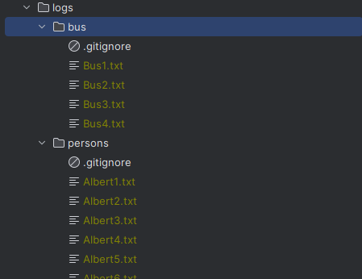
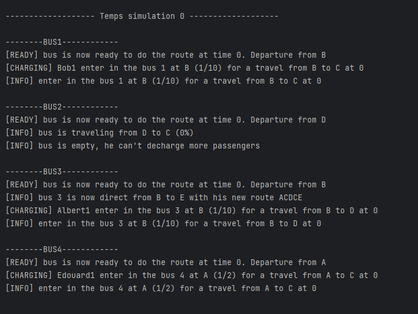

# Man Project

This is a school project. you can find the subject [here](sujet.pdf)

The man project is a project that allows you to find the best route for a bus to take to pick up all the people in a
list. The bus has a maximum capacity and a maximum distance to travel.

## Features

- Log system for each person and bus
- allow to configure the project


## Example of output

### Logs

Directory : [logs](logs)



### Console

Console output :



## Configuration

You can configure the project by changing this files :

- [persons.txt](persons.txt)
- [routes.txt](routes.txt)
- [bus.txt](bus.txt)

/!\ The files must be in the same directory as the main.py file.
/!\ The syntax of the files must be respected.

## Requirements

There is no requirements, only python 3.6 or higher.

## Installation

```bash
git clone https://github.com/achedon12/Man-project.git
```

## Launch

```bash
python main.py persons.txt routes.txt bus.txt
```
